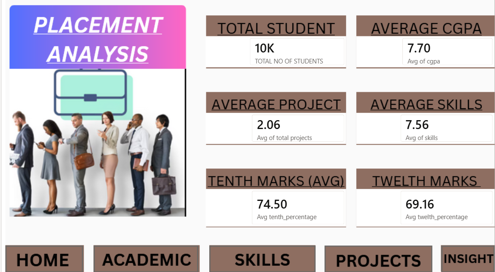
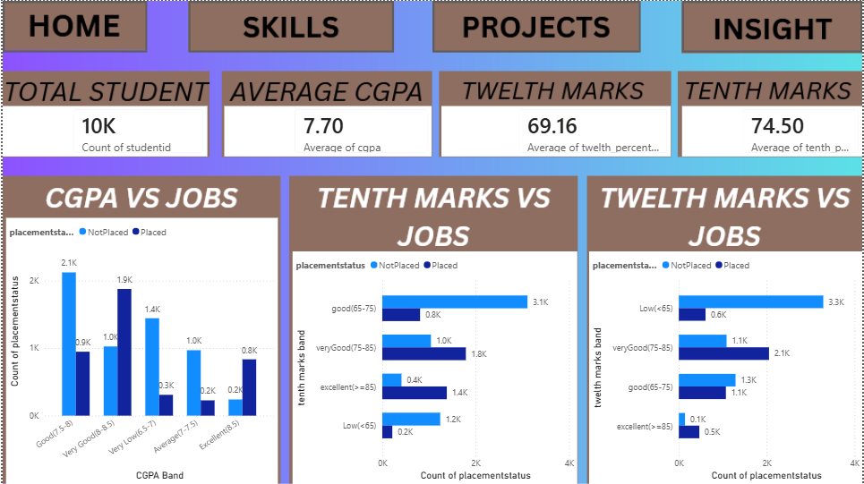
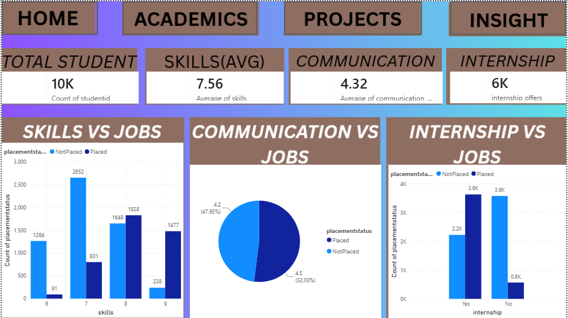
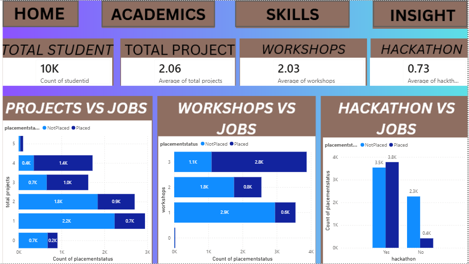
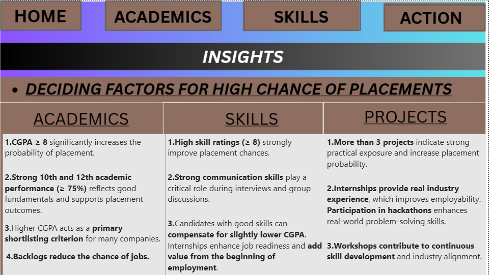
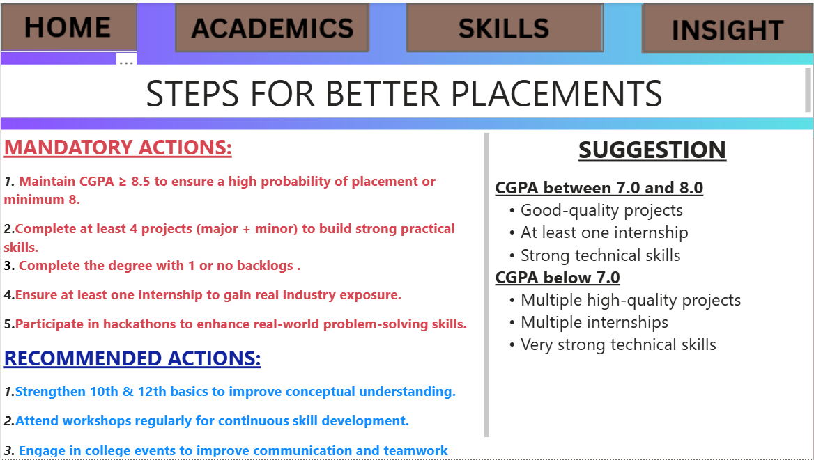

# 🎓 Campus Placement Predictor

A machine learning-powered web app that predicts a student's campus placement probability based on academic performance, technical skills, and professional exposure — and shows which companies (by branch) they're currently eligible for based on historical CGPA cutoffs.

**🔗 Live App:** [placement-prediction-gkyhmzamls8bisfsr8mvke.streamlit.app](https://placement-prediction-gkyhmzamls8bisfsr8mvke.streamlit.app)

---

## 📌 Overview

This project uses a **Logistic Regression** model trained on student academic and portfolio data to estimate the probability of campus placement. It also cross-references a real branch-wise placement dataset to show students:

- Their calculated **placement probability**
- Companies they are **currently eligible for**, based on their branch and CGPA
- Companies they are **not yet eligible for**, along with how much CGPA improvement is needed

---

## ✨ Features

- 📊 **Placement Probability Prediction** — based on CGPA, 10th/12th percentage, technical skills, communication rating, project count, and professional exposure (internships, hackathons, workshops)
- 🏢 **Branch-wise Company Matching** — matches students against real historical placement data (minimum CGPA cutoff, average CTC, number of offers) for their branch
- 🔒 **Eligibility Gap Insights** — for companies not yet accessible, shows exactly how much CGPA increase is needed
- 🎨 **Clean, professional UI** built with Streamlit — designed to feel like a real student-facing career platform
- ⚡ Fast, single-page interactive experience with instant results

---

## 🧠 How It Works

1. **Input collection** — the user enters academic metrics, technical portfolio details, and professional exposure through a simple form.
2. **Feature engineering** — raw inputs are transformed into the model's expected features:
   - `total_projects` = major projects + mini projects
   - `total_experience` = workshops attended + internship (0/1) + hackathon participation (0/1)
   - `education` = average of 10th and 12th percentage
3. **Scaling** — features are scaled using a fitted `MinMaxScaler` to match the training distribution.
4. **Prediction** — a trained `LogisticRegression` model outputs the placement probability via `predict_proba`.
5. **Company matching** — the student's branch and CGPA are checked against a precomputed lookup table (`company_cutoffs.json`) built from real branch-wise placement records, showing eligible vs. locked companies.

---

## 🗂️ Project Structure

```
├── app.py                                  # Streamlit application
├── placement_logistic_model.pkl            # Trained Logistic Regression model
├── placement_scaler.pkl                    # Fitted MinMaxScaler
├── company_cutoffs.json                    # Branch-wise company CGPA/CTC lookup table
├── requirements.txt                        # Python dependencies
├── notebooks/
│   └── placement_model_training.ipynb      # EDA + model training notebook
├── screenshots/
│   ├── dashboard_home.png
│   ├── dashboard_academics.png
│   ├── dashboard_skills.png
│   ├── dashboard_projects.png
│   ├── dashboard_insights.png
│   └── dashboard_action.png
└── README.md
```

---

## 📊 Exploratory Data Analysis (Power BI Dashboard)

Before model training, the placement dataset was explored using an interactive Power BI dashboard to identify the strongest predictors of placement outcomes.

**Home — Key Metrics Overview**


**Academics — CGPA & Marks vs Placement**


**Skills — Technical Skills, Communication & Internship Impact**


**Projects — Projects, Workshops & Hackathons vs Placement**


**Insights — Deciding Factors for Placement**


**Action — Recommended Steps for Better Placement Chances**


### Key EDA Findings
- Students with **CGPA ≥ 8** show a significantly higher placement rate compared to lower CGPA bands.
- **3+ completed projects** and **internship experience** strongly correlate with placement, sometimes compensating for a moderately lower CGPA.
- **Hackathon participation** and **regular workshop attendance** show a positive association with placement outcomes.
- These patterns align with the trained Logistic Regression model's coefficients, where `education`, `total_experience`, and `skills` carry meaningful positive weight toward placement probability.

---

## 📓 Model Training Notebook

The full data cleaning, feature engineering, and model training process (including GridSearchCV hyperparameter tuning for the Logistic Regression model) is available in:

```
Placement (2).ipynb
```

This notebook covers:
- Data cleaning and feature engineering (`total_projects`, `total_experience`, `education`)
- Train/test split and MinMax scaling (fit on training data only, to avoid data leakage)
- Hyperparameter tuning via `GridSearchCV` (`C`, `max_iter`)
- Model evaluation (accuracy, precision, recall, F1-score)
- Coefficient analysis to validate feature impact

---


- **Python**
- **Streamlit** — web app framework
- **scikit-learn** — model training (Logistic Regression, MinMaxScaler)
- **pandas / numpy** — data processing
- **joblib** — model serialization

---

## 📊 Model Details

| Feature | Description |
|---|---|
| `cgpa` | Current CGPA (0–10 scale) |
| `skills` | Technical skills proficiency (0–10 scale) |
| `communication_skill_rating` | Communication rating (1–5 scale) |
| `total_projects` | Major + mini projects completed |
| `total_experience` | Workshops + internship + hackathon participation |
| `education` | Average of 10th and 12th standard percentage |

The model was trained with **GridSearchCV** for hyperparameter tuning (`C`, `max_iter`) and evaluated using accuracy, precision, recall, and F1-score to ensure stable, non-overfit performance.

---

## 🚀 Running Locally

1. **Clone the repository**
   ```bash
   git clone https://github.com/<your-username>/<your-repo>.git
   cd <your-repo>
   ```

2. **Install dependencies**
   ```bash
   pip install -r requirements.txt
   ```

3. **Run the app**
   ```bash
   streamlit run app.py
   ```

4. Open the local URL shown in your terminal (usually `http://localhost:8501`).

---

## 📁 requirements.txt

```
streamlit
pandas
numpy
scikit-learn
joblib
```

---

## ⚠️ Disclaimer

Company eligibility figures shown in the app are derived from **historical minimum CGPA and average CTC of previously placed students**, based on branch-wise placement records. These are **not official eligibility criteria** set by companies and may change year to year. This tool is intended for guidance and self-assessment purposes only.

---

## 📈 Future Improvements

- Expand training dataset for better generalization across CGPA ranges
- Add support for additional academic branches and years
- Include resume/portfolio strength scoring
- Add company-wise historical trend charts (CGPA cutoff over years)

---

## 📄 License

This project is open-source and available under the [MIT License](LICENSE).
